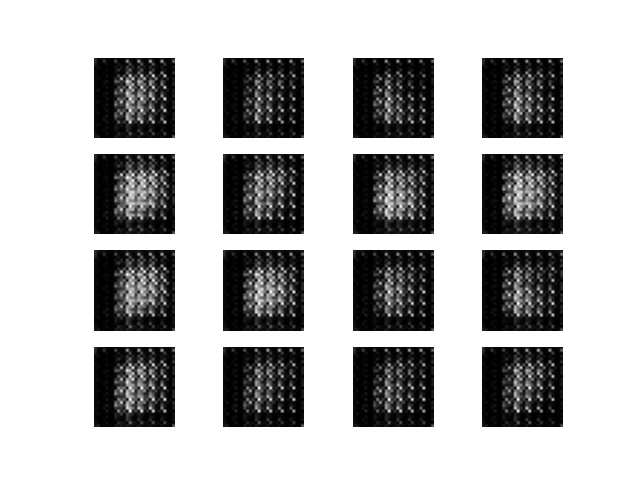

# Prompt Art AI
This repository is for the purpose to recieve user input and generate art. The more specific and detailed the prompt, the more detailed the art will be.

A tutorial demonstrates how to Generate images of handwritten digits using <b>Deep Convolutional Generative Adversarial Network</b> (DCGAN). The code is written using the <b>Keras Sequential API</b> with a tf.GradiantTape training the loop.

## Developers
- Andrew Ramirez | [drewRam](https://github.com/drewRam)

### gif Output After Training

Repository shows the complete code necessary to write and train a GAN.